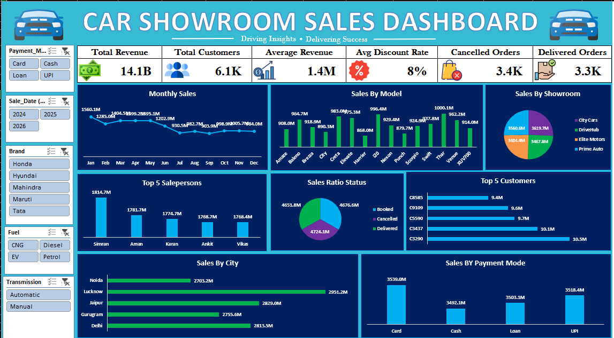

# 🚗 Car Showroom Sales Dashboard


An interactive, fully dynamic Excel dashboard built to track, visualize, and analyze end-to-end sales performance for a multi-brand car showroom network. This project turns raw transactional sales data into a single, decision-ready view — covering revenue trends, customer behavior, sales team performance, order fulfillment health, and regional/channel-wise breakdowns.



---

## 📑 Table of Contents

- [Overview](#-overview)
- [Key Features](#-key-features)
- [Dashboard Metrics](#-dashboard-metrics-sample-snapshot)
- [Dashboard Sections Explained](#-dashboard-sections-explained)
- [Tools & Techniques Used](#-tools--techniques-used)
- [Repository Contents](#-repository-contents)
- [Key Insights](#-key-insights)
- [How to Use](#-how-to-use)
- [Skills Demonstrated](#-skills-demonstrated)
- [Future Improvements](#-future-improvements)
- [Author](#-author)

---

## 📌 Overview

This dashboard consolidates car showroom sales data into a single, interactive view built entirely in **Microsoft Excel** — no external BI tool required. It enables stakeholders (sales managers, showroom owners, or business analysts) to:

- Monitor real-time-style KPIs at a glance
- Identify top-performing models, salespersons, and cities
- Track customer contribution and concentration
- Flag operational red flags such as high order cancellation rates
- Slice and filter data instantly using interactive slicers, without touching a single formula

The goal of this project was to simulate a real-world business intelligence dashboard using only native Excel capabilities — Pivot Tables, Pivot Charts, and Slicers — to deliver a clean, professional, and fully interactive reporting tool.

---

## ✨ Key Features

- 📊 **KPI Summary Cards** — Total Revenue, Total Customers, Average Revenue, Average Discount Rate, Cancelled Orders, and Delivered Orders, all visible at the top of the dashboard
- 🎚️ **Interactive Slicers** — Filter the entire dashboard instantly by Payment Mode, Sale Date (Year), Brand, Fuel Type, and Transmission
- 📈 **Monthly Sales Trend** — Line chart tracking revenue across all 12 months to spot seasonality
- 🚘 **Sales by Model** — Bar chart comparing revenue generated by each car model
- 🏢 **Sales by Showroom** — Pie chart showing revenue distribution across 4 showroom locations
- 🏆 **Top 5 Salespersons** — Ranked bar chart highlighting the best-performing sales staff
- 🔄 **Sales Ratio Status** — Visual breakdown of Booked vs Cancelled vs Delivered orders
- 👥 **Top 5 Customers** — Highest revenue-generating customers ranked by contribution
- 🏙️ **Sales by City** — Regional performance comparison across 5 major cities
- 💳 **Sales by Payment Mode** — Revenue split across Card, Cash, Loan, and UPI transactions
- 🎨 **Custom Themed Design** — Dark navy dashboard theme with consistent color-coding for readability and a professional look

---

## 📊 Dashboard Metrics (Sample Snapshot)

| Metric | Value |
|---|---|
| 💰 Total Revenue | 14.1B |
| 👥 Total Customers | 6.1K |
| 📈 Average Revenue | 1.4M |
| 🏷️ Average Discount Rate | 8% |
| ❌ Cancelled Orders | 3.4K |
| ✅ Delivered Orders | 3.3K |

---

## 🧩 Dashboard Sections Explained

### 1. KPI Cards (Top Row)
Six high-level metrics giving an instant health check of the business — revenue, customer base, average ticket size, discounting behavior, and order fulfillment status.

### 2. Monthly Sales Trend
A line chart tracing revenue month by month, useful for identifying seasonal dips and recovery patterns across the year.

### 3. Sales by Model
A bar chart comparing every car model's total revenue contribution, helping identify best-sellers vs. underperforming models.

### 4. Sales by Showroom
A pie chart showing how revenue is distributed across the four showroom locations — City Cars, DriveHub, Elite Motors, and Prime Auto.

### 5. Top 5 Salespersons
A ranked bar chart of the five highest revenue-generating salespeople, useful for performance reviews and incentive planning.

### 6. Sales Ratio Status
A pie chart comparing Booked, Cancelled, and Delivered order volumes — a critical operational health indicator.

### 7. Top 5 Customers
A horizontal bar chart listing the highest-spending customers by revenue contribution.

### 8. Sales by City
A horizontal bar chart comparing total revenue across five major cities.

### 9. Sales by Payment Mode
A bar chart comparing revenue collected through each payment channel — Card, Cash, Loan, and UPI.

### 10. Slicer Panel
A left-hand control panel with five slicers (Payment Mode, Sale Date, Brand, Fuel, Transmission) that instantly filter every chart and KPI on the dashboard simultaneously.

---

## 🛠️ Tools & Techniques Used

- **Microsoft Excel**
  - Pivot Tables & Pivot Charts
  - Slicers for multi-dimensional interactive filtering
  - Formula-based KPI calculations (SUM, AVERAGE, COUNT-based aggregations)
  - Custom dashboard layout design & conditional formatting
  - Data visualization: bar charts, line charts, and pie charts
  - Data cleaning and structuring for pivot-based reporting

---

## 📂 Repository Contents

```
├── Car_Showroom_DashBoard.xlsx    # Main Excel dashboard file (with raw data + dashboard sheet)
├── Car_Showroom_Dashboard.png     # Dashboard preview image
└── README.md                      # Project documentation
```

---

## 🔍 Key Insights

- 🚙 **Thar** is the top-selling model by revenue (1000.1M), while **Harrier** (868.0M) and **Punch** (879.7M) lag behind
- 🏆 **Simran** is the top-performing salesperson (1814.7M), significantly ahead of the rest of the team
- 🏢 Sales performance across all 4 showrooms is fairly balanced, with **DriveHub** (3619.7M) marginally leading — no single location dominates
- ⚠️ **Cancelled orders (3.4K) are nearly on par with delivered orders (3.3K)** — this is the single most critical insight from the dashboard and flags a potential issue in the order fulfillment pipeline worth investigating further
- 👥 The gap between the top 5 customers (9.4M to 10.5M) is small, indicating **low customer concentration risk** and a healthy, diversified customer base
- 🏙️ Revenue distribution across cities (Delhi, Gurugram, Jaipur, Lucknow, Noida) is fairly even, ranging between 2700M–2950M
- 💳 Payment mode usage is nearly evenly split across Card, Cash, Loan, and UPI — showing no strong customer bias toward a single payment channel

---

## 🚀 How to Use

1. Download `Car_Showroom_DashBoard.xlsx` from this repository
2. Open the file in **Microsoft Excel (2016 or later recommended)** for full slicer support
3. Navigate to the **Dashboard** sheet
4. Use the slicers on the left panel to filter by:
   - Payment Mode (Card / Cash / Loan / UPI)
   - Sale Date / Year (2024 / 2025 / 2026)
   - Brand (Honda / Hyundai / Mahindra / Maruti / Tata)
   - Fuel Type (CNG / Diesel / EV / Petrol)
   - Transmission (Automatic / Manual)
5. All KPI cards and charts will update dynamically in real time based on your selections
6. Reset any slicer by clicking the "clear filter" icon on the top-right of the slicer box

---

## 🎯 Skills Demonstrated

- Data visualization & dashboard design
- Pivot Table and Pivot Chart creation
- Interactive filtering using Slicers
- Business/data analysis and insight generation
- KPI identification and reporting
- Dashboard UI/UX layout planning in Excel

---

## 📈 Future Improvements

- Add a year-over-year (YoY) comparison view for monthly sales trends
- Correlate discount rate with cancellation rate to identify root causes of order cancellations
- Add a drill-down feature for individual salesperson or city-level performance
- Automate data refresh using Power Query for live/external data sources
- Migrate to Power BI for enhanced interactivity and cloud sharing capability

---

## 👤 Author

**Kartikey Gautam**

[](https://www.linkedin.com/in/kartikey-gautam-903711382/)
[](https://github.com/gautam2007kartikey-tech)

Feel free to connect or reach out for feedback, collaboration, or suggestions!


⭐ **If you found this dashboard useful, consider giving this repository a star — it really helps!**
